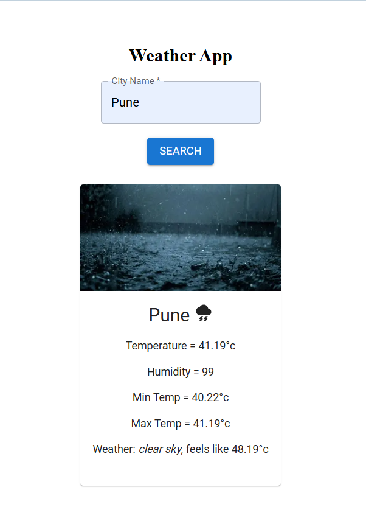

# 🌦️ React Weather Dashboard

A simple and responsive weather application built using **React + Vite** that allows users to search for real-time weather information by city name.

---

## 🚀 Features

* 🔍 Search weather by city name
* 🌡️ Displays temperature, humidity, and weather conditions
* 📱 Responsive UI design
* ⚡ Fast performance using Vite
* 🎨 Clean and user-friendly interface

---

## 🛠️ Tech Stack

* **Frontend:** React, CSS
* **Build Tool:** Vite
* **API:** Weather API (e.g., OpenWeatherMap)

---

## 📂 Project Structure

```
React-Weather-Dashboard/
│── public/
│── src/
│   ├── App.jsx
│   ├── WeatherApp.jsx
│   ├── SearchBox.jsx
│   ├── InfoBox.jsx
│   ├── App.css
│   └── main.jsx
│── index.html
│── package.json
│── vite.config.js
```

---

## ⚙️ Installation & Setup

1. Clone the repository:

   ```bash
   git clone https://github.com/your-username/React-Weather-Dashboard.git
   ```

2. Navigate to the project folder:

   ```bash
   cd React-Weather-Dashboard
   ```

3. Install dependencies:

   ```bash
   npm install
   ```

4. Run the project:

   ```bash
   npm run dev
   ```

5. Open in browser:

   ```
   http://localhost:5173/
   ```

---

## 🌐 API Configuration

* Get your API key from a weather service (like OpenWeatherMap)
* Add it inside your project (usually in `SearchBox.jsx` or config file)

---

## 📸 Screenshots



---

## 👨‍💻 Author

**Rohit Shinde**

---
